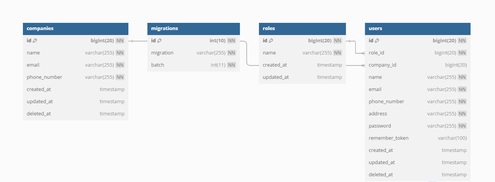

# Company Management System API

## Overview

Welcome to the **Company Management System API**! 🚀 This system allows companies to manage their employees effectively, with a clear distinction between **three main roles**: **SuperAdmin**, **Manager**, and **Employee**. Each role has different access rights and responsibilities within the system.

### Key Features:

-   **Role-Based Access Control (RBAC):**  
    This system implements a clear **Role-Based Access Control (RBAC)** structure, where each user role (SuperAdmin, Manager, and Employee) has specific access permissions based on their role.
-   **JWT Authentication:**  
    We use **JSON Web Tokens (JWT)** for authentication, ensuring secure and stateless API access. All API requests require a valid JWT token to authenticate the user.

-   **Data Validation:**  
    The system includes **comprehensive validation** for data inputs to ensure consistency and prevent errors during the user interaction with the system.

---

## **User Roles**

1. **SuperAdmin**:

    - Can create and manage companies.
    - Can assign managers to companies.
    - Can delete companies (soft delete).
    - Full access to manage all aspects of the system.

2. **Manager**:

    - Can create, update, and delete employees in their respective companies.
    - Can view details of employees within their company.
    - Can view and update their own profile.

3. **Employee**:
    - Can view details of all employees within their company.
    - Can view and update their own profile.

---

## **Authentication**

We use **JWT (JSON Web Token)** for authentication. All API requests require a valid token which is included in the `Authorization` header as `Bearer {token}`.

-   **Login:**  
    To log in and receive a token, use the `POST /api/login` endpoint. You will receive a JWT token that you will include in the headers for subsequent API requests.

---

## **API Documentation**

The full API documentation is available at the following link:  
[API Documentation](https://documenter.getpostman.com/view/27624439/2sAYBaAA9j)

---

## **ERD (Entity Relationship Diagram)**

Here is the ERD diagram for this system:

---

## **Conclusion**

This system is designed to help companies manage their employees in an efficient and secure way. It implements a role-based access control structure, where **SuperAdmin**, **Manager**, and **Employee** have different permissions to manage and access data.

With **JWT authentication**, the system ensures secure access for all users, and **data validation** is applied to keep everything consistent and error-free. The **API documentation** provides detailed explanations on how to interact with each endpoint, making it easy to integrate or extend the system.

Whether you're a SuperAdmin managing multiple companies, a Manager handling employees, or an Employee managing your own profile, this system ensures that everyone has the right tools and access to do their job efficiently.

Feel free to explore the provided **API documentation** and test the endpoints to see how everything works. If you have any questions or need support, don’t hesitate to contact us.

Happy coding! 🎉
